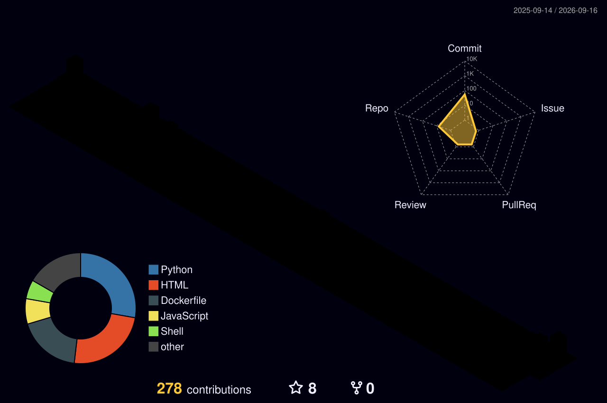

<div align="center">

# SATYAJIT DAS


<br/>


<br/>
<br/>

<a href="https://rootbysatya.in/"></a>
<a href="https://www.linkedin.com/in/satyajit-das-86bbb948/"></a>

</div>

<br/>

```
$ cat mission.txt
GitOps-driven Kubernetes platforms on GKE, powered by FluxCD.
Infra automated with Terraform / OpenTofu across multi-cloud.
Built for reliability. Operated at scale.
```

<br/>

## `$ currently --active`

```diff
+ Operating GKE-based platforms with FluxCD GitOps workflows
+ Modernizing GitLab CI pipelines for large-scale deployments
+ Building Kubernetes operators & CRDs for platform automation
+ Driving Datadog observability and infrastructure security remediation
+ Managing IaC with Terraform / OpenTofu across multi-cloud environments
```

<br/>

## `$ stack --grep platform`

<div align="center">


</div>

<br/>

## `$ stats --theme red`

<div align="center">


<br/>


<br/>


</div>

<br/>

## `$ contributions --render 3d`

<div align="center">



</div>

<br/>

<div align="center">
<sub>$ exit</sub>
</div>
